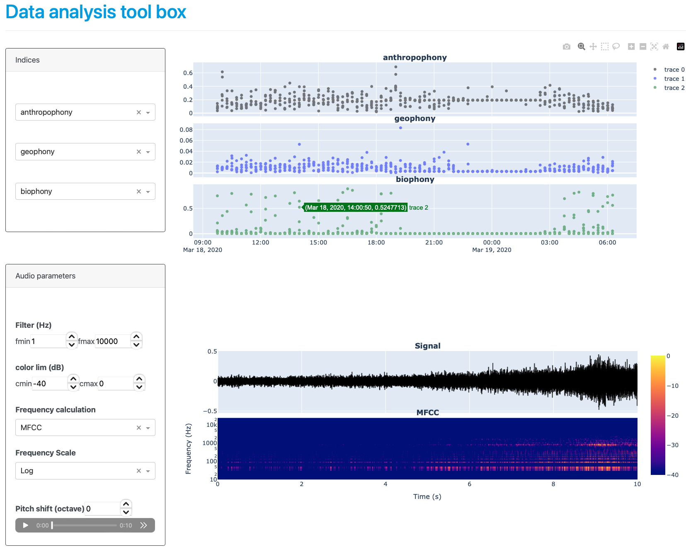

# EAVT
Eco-Acoustic Visualization Tools

# Currently in development


## How to use

First, create a directory with wav audio files named YYMMDD_HHMMSS.wav/flac or What_EVER_YYMMDD_HHMMSS.wav/flac. 
Then, use process.py to extract the eco-acoustic indices and the tagging.
Finally, use the dash_app.py script to run the web application.




## Audio processing
**First download the ResNet22 pretrained model using instructions [here](https://github.com/qiuqiangkong/audioset_tagging_cnn#audio-tagging-using-pretrained-models)**

```
python process.py [-h] [--data_path DATA_PATH] [--save_path SAVE_PATH] [--name NAME] [--process_tagging PROCESS_TAGGING] [--process_indices PROCESS_INDICES] [--audio_format AUDIO_FORMAT][--length_audio_segment LENGTH_AUDIO_SEGMENT] [--save_audio_flac SAVE_AUDIO_FLAC] [--Fmin FMIN] [--Fmax FMAX]

Script to process sound files recorded by Audiomoth

options:
  -h, --help            show this help message and exit
  --data_path DATA_PATH
                        Path to wav files
  --save_path SAVE_PATH
                        Path to save meta data
  --name NAME           name of measurement
  --process_tagging PROCESS_TAGGING
                        Process tagging 0 or 1
  --process_indices PROCESS_INDICES
                        Process indices 0 or 1
  --audio_format AUDIO_FORMAT
                        wav or flac
  --length_audio_segment LENGTH_AUDIO_SEGMENT
                        Length of analyzing window MUST BE LOWER THAN SIGNAL LENGTH
  --save_audio_flac SAVE_AUDIO_FLAC
                        Saving audio in flac format (needed to run visualization tool)
  --Fmin FMIN           Freq min (filter)
  --Fmax FMAX           Freq max (filter)

```
### Example

```
python3 process.py --save_path example/metadata/ --data_path example/metadata/audio_0002/ --name 0004 --audio_format flac --length_audio_segment 3 --process_tagging 0
```
processing only ecoacoustic indices of flac format audio files on 3 s segment length.


Eco-acoustic indices can be added in the script indices.py.
The name of the index must be added in the list `name_indices` and the calculation part in the function `compute_ecoacoustics`. 

Each wav file is divided into 10 second segments and converted to flac.


## Dash app

```
python dash_app.py [-h] [--save_path SAVE_PATH]

Script to display sound files recorded by Audiomoth

options:
  -h, --help            show this help message and exit
  --save_path SAVE_PATH
                        Path to save meta data
  --name NAME           name of measurement
```


Code for Audioset Tagging CNN from [Qiu Qiang Kong](https://github.com/qiuqiangkong/audioset_tagging_cnn)
Code for Eco-acoustic indices from [Patric Guyot](https://github.com/patriceguyot/Acoustic_Indices) and [Sylvain Haupert and Juan Sebastian Ulloa](https://github.com/scikit-maad/scikit-maad)

## Specific settings for Buzz Detection 
```
python process.py --save_audio_flac 1 --data_path /home/nfarrugi/Documents/datasets/BumbleBuzz/BumbleBuzz/$curdir --name $curdir --Fmax 15999 --length_audio_segment 5 --process_tagging 1 --save_path /home/nfarrugi/Documents/datasets/BumbleBuzz/BumbleBuzz/detection --audio_format wav
```
